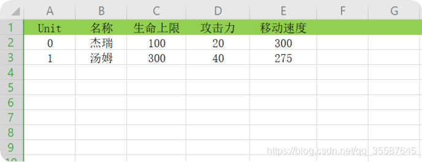
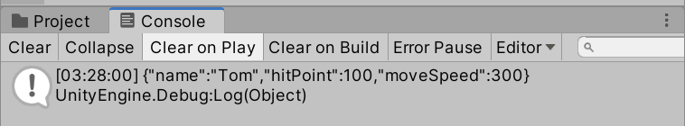
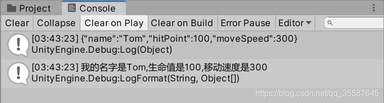
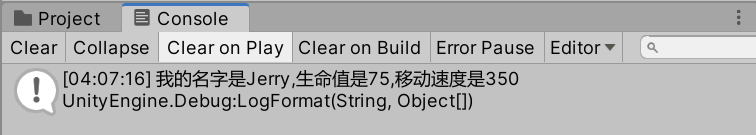
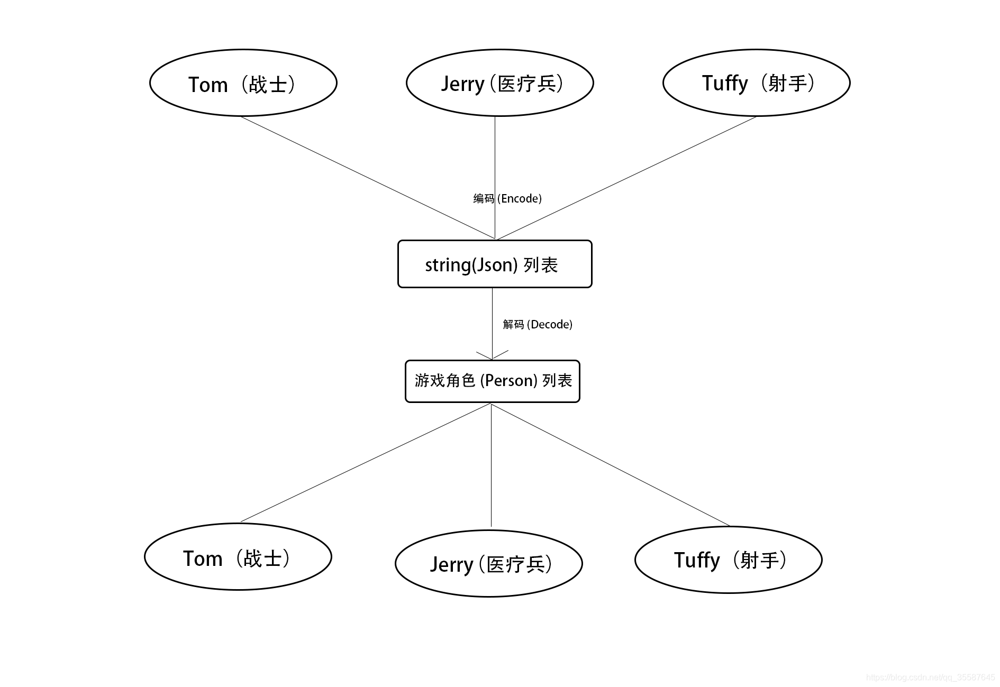
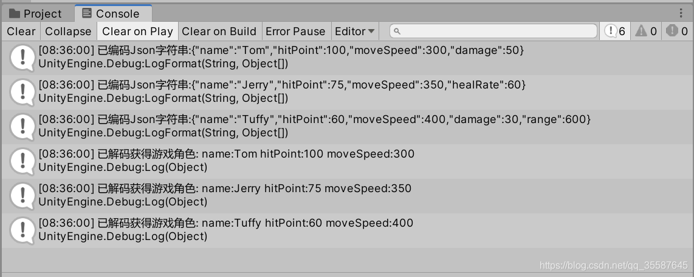
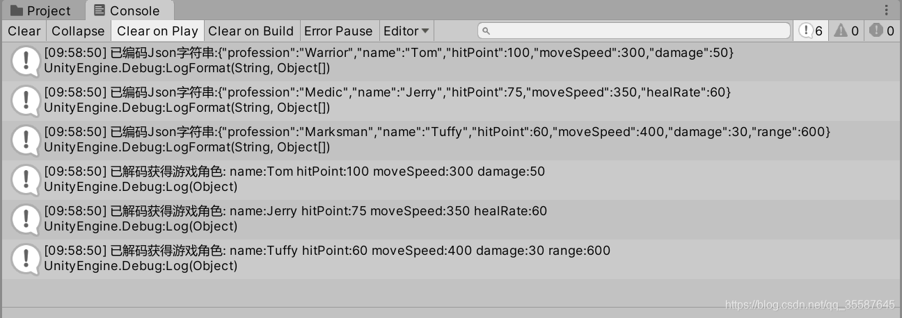
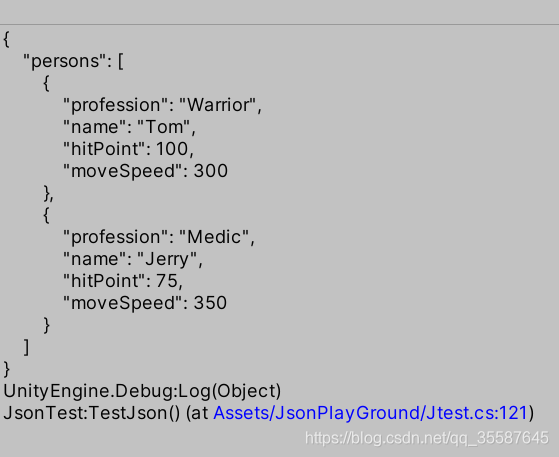

# [转载]Unity数据读写与存档（2）Json：成为神笔马良

原文地址：https://blog.csdn.net/qq_35587645/article/details/107141246

在上一篇我们知道，通过引入适当的第三方库并编写代码，就可以在Unity内，从Excel表格中读取一些数据。



配置表的存在，的确可以帮助开发团队中没有编程基础的小伙伴管理游戏数据，或者将游戏的策划数据较为方便地批量转移到Unity内；不过，使用Excel来管理游戏数据，功能还是较为有限，而且使用起来不方便。**Excel表格只适合存储简单的文本和数字类数据，对于数组、列表等复杂数据则完全无能为力；此外，读取配置表时必须手动编写非常繁琐的读表逻辑，将表格内各单元格的数据赋值到代码内部的各种变量上。更可怕的是，游戏内有多少个地方需要读表，就要编写多少种不同的读表算法；这对于大型项目来说绝对是可怕的负担。**

> 现在我们希望找到一种更好的方法，来将代码内的数组、列表、乃至自定义类(class)这样的数据原封不动地存储成像“配置表”一样的可阅读文本；也能在适当的时机从上述文本中“读到”这些数据类型，然后将数据还原到代码中。有没有这样的解决方案呢？当然有，Unity为我们提供了UnityEngine.JsonUtility这个静态类。使用它，我们可以将游戏内数据转化为Json字符串，或者从Json字符串或文件中读取数据。

Json是什么东西？网上可以查到详细的解释，但那些解释对我们将要实现的功能而言没有什么用。目前你只需要知道：**Json是一种以特殊格式写成的字符串或者文件，它可以用于表示我们代码中的某些数据。**

## 1.使用Json记录和读入数据

我们直接来模拟一个情境，并且看一段代码。

假设我们的游戏中存在人物（Person）类，人物具有名字、生命值和移动速度。

```c#

public class Person
{
    public string name;//名字
    public int hitPoint;//生命值
    public int moveSpeed;//移动速度
 
    public Person()
    {
 
    }
 
    public Person(string Name,int HitPoint,int MoveSpeed)
    {
        name = Name;
        hitPoint = HitPoint;
        moveSpeed = MoveSpeed;
    }
}
```

容易知道，**name-名字、hitPoint-生命值、moveSpeed-移动速度**这三项数据是每个Person实例的**属性**——只要记录下来这三项数据，就可以唯一确定一个游戏内角色——Person。

现在，我们打开任意一个Unity场景，新建一个C#文件（文件名不限），编写代码来定义一个名为Tom的角色，然后用Json记录它的数据。

```c#
using System.Collections.Generic;
using UnityEngine;
using UnityEditor;
 
public class Person
{
    public string name;//名字
    public int hitPoint;//生命值
    public int moveSpeed;//移动速度
 
    public Person()
    {
 
    }
 
    public Person(string Name,int HitPoint,int MoveSpeed)
    {
        name = Name;
        hitPoint = HitPoint;
        moveSpeed = MoveSpeed;
    }
}
 
public static class JsonTest
{
    [MenuItem("Json/TestJson")]//在Unity菜单栏上添加选项卡和选项
    public static void TestJson()
    {
        Person Tom = new Person("Tom", 100, 300);//创建一个名为Tom的角色，生命值为100，移动速度为300
        string TomStr = JsonUtility.ToJson(Tom);
        Debug.Log(TomStr);
    }
}

```

编写完成后，在Unity菜单栏内选择Json-TestJson，观察控制台的输出。



我们看到，控制台输出了字符串TomStr,它是JsonUtility对Tom进行编码后生成的字符串。作为一行Json数据，TomStr记载了Person实例Tom的全部属性。不难猜到，通过这组字符串，我们可以准确无误地在代码中的其它地方还原出Tom，或者说还原出一个完整的Person实例。

下面我们为TestJson方法补充内容，来解读刚刚生成的TomStr字符串，并将其还原回Tom。

```c#

public static class JsonTest
{
    [MenuItem("Json/TestJson")]//在Unity菜单栏上添加选项卡和选项
    public static void TestJson()
    {
        Person Tom = new Person("Tom", 100, 300);//创建一个名为Tom的角色，生命值为100，移动速度为300
        string TomStr = JsonUtility.ToJson(Tom);
        Debug.Log(TomStr);
        Person unknownPerson = (Person)JsonUtility.FromJson(TomStr, typeof(Person));
        Debug.LogFormat("我的名字是{0},生命值是{1},移动速度是{2}", unknownPerson.name, unknownPerson.hitPoint, unknownPerson.moveSpeed);
    }
}
```

再次执行Json-TestJson并观察输出。

 
在上面的TestJson中，我们用JsonUtility.FromJson方法解读了TomStr中包含的Person属性信息，将解读出来的信息输出为Person类型，然后转化为一个新的Person实例——unknownPerson。在控制台中调取unknownPerson的各项属性，可以发现它成为了Tom的一个准确的副本——其所有属性都正是Tom的属性。

这时我们就看到，**JsonUtility.FromJson**方法完成了一件我们先前难以想象的事——**它将一个平平无奇的字符串，转变成了一个在代码中活生生的Person类实例。**而很明显，这个用于转化的字符串可以出自各种来源——**通过适当的方法生成、手动打字输入、从现有的文件中读取，甚至是从网络连接中获取。**

**现在，我们继续修改TestJson方法，当一回“神笔马良”：手写一段字符串，并将其转化为一个游戏内角色Jerry。**

```c#
public static class JsonTest
{
    [MenuItem("Json/TestJson")]//在Unity菜单栏上添加选项卡和选项
    public static void TestJson()
    {
        string JerryStr = @"{""name"":""Jerry"",""hitPoint"":75,""moveSpeed"":350}";
        Person Jerry = (Person)JsonUtility.FromJson(JerryStr, typeof(Person));
        Debug.LogFormat("我的名字是{0},生命值是{1},移动速度是{2}", Jerry.name, Jerry.hitPoint, Jerry.moveSpeed);      
    }
}
```

执行Json-TestJson并观察输出。

 

现在可以看到，通过上面的代码，我们直接将代码中手动写入的字符串**JerryStr**转化成了游戏内角色实例**Jerry**。是不是就像变魔术一样？

> **你可能会注意到，上面的字符串JerryStr中采用的格式，和先前输出的TomStr字符串有点不一样。这是因为C#字符串中对于双引号"需要转义，否则无法确定字符串的边界。在JerryStr中，开头的@表示在字符串中不使用转义符\，并用两个双引号""指代一个双引号"。**
>
> **（关于C#字符串中的转义，可以自行查阅相关资料）**

 此外，JsonUtility中还提供了FromJson的变种方法FromJsonOverwrite，该方法可以直接将读出的Json数据应用到另一个类实例上。例如，前面的语句

```c#
Person Jerry = (Person)JsonUtility.FromJson(JerryStr, typeof(Person));
```

还可以改写成这种形式：

```c#
Person Jerry = new Person();
JsonUtility.FromJsonOverwrite(JerryStr, Jerry);//将JerryStr中读出的数据应用到类实例Jerry上
```

这两种写法的语义和输出结果都没有区别。

## 2.更高灵活性：处理派生类型

上面的示例演示了Json字符串创建和读取的基本操作，但在实际应用中，我们不一定能保证需要读取的数据就是如假包换的Person类。现在来设想更复杂的情境。

> **游戏中的角色被定义为Person基类，但Person基类有若干个不同的派生类，作为游戏内角色的职业分支。**
>
> **例如，战士(Warrior)子类拥有一个新属性Damage(攻击力)，医疗兵(Medic)子类拥有新属性HealRate(治疗速率）、射手(Marksman)子类则拥有两个新属性Damage(攻击力)和Range(射程)。**
>
> **现在，我们打算生成若干个游戏内角色的Json字符串，然后将这些字符串解码，使它们变回原来的游戏角色。**



现在，我们大幅度修改前面的代码来表现这个工作流程。整个流程的代码如下：

> **Tips: 与前面的代码相比，这段代码为Person类及其子类都引入了重载的ToString方法。这是为了在调试时能够让每一个游戏角色进行“自我介绍”，报出自身的各项数据。**

```c#

using System.Collections.Generic;
using UnityEngine;
using UnityEditor;
 
public class Person
{
    public string name;
    public int hitPoint;
    public int moveSpeed;
 
    public Person()
    {
 
    }
 
    public Person(string Name,int HitPoint,int MoveSpeed)
    {
        name = Name;
        hitPoint = HitPoint;
        moveSpeed = MoveSpeed;
    }
 
    public override string ToString()
    {
        string ret = string.Format("name:{0} hitPoint:{1} moveSpeed:{2}", name, hitPoint, moveSpeed);
        return ret;
    }
}
 
public class Warrior : Person
{
    public int damage;
 
    public Warrior()
    {
 
    }
 
    public Warrior(string Name, int HitPoint, int MoveSpeed, int Damage) : base(Name, HitPoint, MoveSpeed)
    {
        damage = Damage;
    }
 
    public override string ToString()
    {
        string ret = string.Format("name:{0} hitPoint:{1} moveSpeed:{2} damage:{3}", name, hitPoint, moveSpeed, damage);
        return ret;
    }
}
 
public class Medic : Person
{
    public int healRate;
 
    public Medic()
    {
 
    }
 
    public Medic(string Name, int HitPoint, int MoveSpeed, int HealRate) : base(Name, HitPoint, MoveSpeed)
    {
        healRate = HealRate;
    }
 
    public override string ToString()
    {
        string ret = string.Format("name:{0} hitPoint:{1} moveSpeed:{2} healRate:{3}", name, hitPoint, moveSpeed, healRate);
        return ret;
    }
}
 
public class Marksman : Person
{
    public int damage;
    public int range;
 
    public Marksman()
    {
 
    }
 
    public Marksman(string Name, int HitPoint, int MoveSpeed, int Damage, int Range) : base(Name, HitPoint, MoveSpeed)
    {
        damage = Damage;
        range = Range;
    }
 
    public override string ToString()
    {
        string ret = string.Format("name:{0} hitPoint:{1} moveSpeed:{2} damage:{3} range:{4}", name, hitPoint, moveSpeed, damage, range);
        return ret;
    }
}
 
public static class JsonTest
{
    [MenuItem("Json/TestJson")]//在Unity菜单栏上添加选项卡和选项
    public static void TestJson()
    {
        //定义三名游戏角色，分别是战士Tom，医疗兵Jerry和射手Tuffy
        Warrior Tom = new Warrior("Tom", 100, 300, 50);
        Medic Jerry = new Medic("Jerry", 75, 350, 60);
        Marksman Tuffy = new Marksman("Tuffy", 60, 400, 30, 600);
 
        List<Person> Characters = new List<Person> { Tom, Jerry, Tuffy };//创建一个Person列表，用于存储全部游戏角色
 
        List<string> CharactersJson = new List<string>();//创建一个string列表，存储每名游戏角色的json数据
 
        //将每一名角色依次编码为Json数据，存入CharactersJson列表中
        foreach (Person character in Characters)
        {
            string json = JsonUtility.ToJson(character);
            Debug.LogFormat("已编码Json字符串:{0}", json);//在这里监控一下，看看json字符串的生成是否正确
            CharactersJson.Add(json);
        }
 
        List<Person> DecodedCharacters = new List<Person>();//创建一个新的Person列表，用于存储json数据解码后生成的游戏角色
 
        //对于每份json数据，将其解码为游戏角色Person
        foreach(string json in CharactersJson)
        {
            Person person_Decoded = DecodePerson(json);
            DecodedCharacters.Add(person_Decoded);
        }
 
        //要求解码出的游戏角色进行自我介绍
        foreach(Person character in DecodedCharacters)
        {
            Debug.Log("已解码获得游戏角色: " + character.ToString());
        }
    }
 
    public static Person DecodePerson(string personAsJson)
    {
        Person decodedPerson = (Person)JsonUtility.FromJson(personAsJson, typeof(Person));
        return decodedPerson;
    }
}
```

在这段代码的设计中，我们意图实现的效果是这样的：

> 第一步：将**战士Tom**、**医疗兵Jerry**和**射手Tuffy**的数据编码为json字符串并存入列表中；
>
> 第二步：从该列表**(CharacterJson)**中读取这些json字符串数据，将它们解码变回战士Tom、医疗兵Jerry、射手Tuffy；
>
> 第三步：让每名被解码出来的角色播发自己的ToString()方法，观察它们是否已经被正确解码。

那么，执行出来的效果是否正确呢？执行Json-TestJson并观察输出。



执行结果正确吗？不太对，好像出了一些问题。**三名角色的攻击力、治疗速率、射程等职业专属数据，在解码完成后全都丢失了。**

分析输出结果可以发现，我们在对三名游戏角色进行编码时，编码的内容符合它们各自的类型Warrior、Medic和Marksman，包含了它们各自类型所特有的数据；而在解码之后，三名游戏角色显然都被解码成了Person基类的实例——它们各自所属的派生类型，以及包含在派生类型属性中的**攻击力、治疗速率、射程**等数据都丢失了。

问题的来源出在这里：

```c#
List<string> CharactersJson = new List<string>();//创建一个string列表，存储每名游戏角色的json数据
```

我们在对角色列表内各个游戏角色的Json数据进行解码之前，面对存储着一大堆json字符串的列表CharactersJson，我们只能知道列表的每个成员都代表着一个游戏角色（Person类型）；至于它们具体属于哪个派生类（战士/医疗兵/射手），在解码之前我们是不知道的。因此，我们的解码方法**DecodePerson**只能写成这个样子：

```c#

public static Person DecodePerson(string personAsJson)
{
    Person decodedPerson = (Person)JsonUtility.FromJson(personAsJson, typeof(Person));//将json数据解码为Person类
    return decodedPerson;
}
```

 对于每一条传入解码方法内的json数据，因为我们无法断定它记载了哪种职业，所以只能根据Person类型进行笼统的破译，破译出来的结果只是一个Person基类实例，而非Person的某个派生类（角色职业）的实例；或者说，我们无法在**FromJson**的第二个参数中直接写入精确的类型**(Warrior/Medic/Marksman)**，来获取最完整的数据。

> **这就好像我们拿着一本用密文写成的军队名册，目前只知道每一行代表军队中的一名成员；但是在破译密文之前，我们无法知道每一行密文记录的成员具体属于什么军种。在这种情况下，我们无法做到有针对性地解读每一行密文，来获取与该行密文所指代成员的军种相关的具体信息。**

## 3.正确应对未知类型

怎样解决这个问题呢？其实，解决起来一点都不难。我们首先对游戏角色基类Person稍加修改，使每一个Person实例都能够自行指示出自身所属的派生类型，或者说职业。(这里要先添加using System来使用System.Type变量类型）

```c#

using System.Collections.Generic;
using UnityEngine;
using UnityEditor;
using System;
 
public class Person
{
    public string profession;//记录自身所属的具体类型名称
    public string name;
    public int hitPoint;
    public int moveSpeed;
 
    public Person()
    {
        profession = this.GetType().ToString();//在创建时记录自身所属的类型
    }
 
    public Person(string Name, int HitPoint, int MoveSpeed) : this()//同上
    {
        name = Name;
        hitPoint = HitPoint;
        moveSpeed = MoveSpeed;
    }
 
    public override string ToString()
    {
        string ret = string.Format("name:{0} hitPoint:{1} moveSpeed:{2}", name, hitPoint, moveSpeed);
        return ret;
    }
}

```

这里，我们为Person类添加了一个新属性string profession——它是每个Person实例所属的**具体类型**的**类名**的**字符串**形式。

这是什么意思呢？在C#中，GetType()是一个任意对象(object)都具有的方法成员；该方法会返回该对象的**具体**类型。这里的“具体类型”指的是该对象所属的**最细分派生类。**

> **例如，小明是中国人，也是中国-辽宁省人，也是中国-辽宁省-沈阳市人。现在对小明调用其GetType()方法，输出的应该是"中国辽宁省沈阳市人"，而不会是"中国人"或"中国辽宁省人"。**

于是我们知道，string profession将会忠实地记录每个Person实例的具体派生类，即每名游戏角色的具体职业；这样一来，我们的解码方法**DecodePerson**就有了更大的操作空间。首先可以将json数据解码为Person基类，然后从解码到的Person属性中读取职业名profession；然后根据profession所代表的具体派生类再进行一次解码，获得准确无误的游戏角色数据。

修改解码方法***DecodePerson**如下：

```c#
public static Person DecodePerson(string personAsJson)
{
    Person decodedPerson = (Person)JsonUtility.FromJson(personAsJson, typeof(Person));//先将json数据解码为Person类
    Type type = Type.GetType(decodedPerson.profession);//从解码出的Person类实例中读取角色的职业名
    //这里的Type.GetType(string)是System.Type静态类的特有重载，用于将字符串转化为Type类型，与前面的Object.GetType()不是一个意思
 
    decodedPerson = (Person)JsonUtility.FromJson(personAsJson, type);//根据职业名进行二次解码，获取准确的派生类型
    return decodedPerson;
}

```

现在，这个方法会对传入的json数据进行两次解码。第一次解码获取的是对应游戏角色作为Person基类的实例，用于取得Person属性中的profession字符串，即该角色所属的派生类名称**(有点像“职业名片”)**；第二次解码会根据前面获取的职业签名再次解码json数据，获得完整的角色信息。

修改完成后，再次执行Json-TestJson并观察输出。



这一次，可以看到解码结果正确无误，所有的游戏角色数据在编码-解码后都得到了完美的还原。

> **Tips:** 事实上，正确区分Json数据所指代的派生类的方法，并不止前面介绍的这一种。
>
> 例如，我们可以选择不修改Person类，而是让DecodeName方法不再接收一份Json数据，转而接收一份包含Json数据的“消息协议”。对于一个类型为Marksman的游戏角色，我们可以将其编码为类似"Marksman|{......}"(花括号内为json数据）的形式再传入DecodeName方法，利用中间的分隔符来承载“类名”和“json字符串”两项数据，这样也能达到正确解码的效果。不同的处理方法各有优劣，你可以自行探究。**其实，这种“消息协议”式的数据传输风格在Socket网络通信中更加常用，**此处暂不详述。

到这里，希望你已经理解了JsonUtility的用法，并掌握了如何通过Json来记录、读取和应用各种数据。

#### 4.一些注意事项

以下是一些使用JsonUtility时可能遇到的"坑“，写在这里以供参考。

> **一、哪些数据可以用JsonUtility编码？**
>
> **JsonUtility.ToJson()可以编码以下对象:**
>
> （1）各类数值(int、float、double等）；
>
> （2）字符串(string)；
>
> （3）自定义的类(class)。
>
> **JsonUtility.ToJson()不能编码以下对象:**
>
> 字典(Dictionary)、队列(Queue)、栈(Stack)。
>
> **以下对象的情况特殊:**
>
> 数组、列表(List<T>)
>
> **当它们作为单独的参数被传入JsonUtility.ToJson()中时，无法成功编码；但是当它们作为一个类的公有成员时，对包含它们的类进行编码，则类内部的数组/列表可以被正确编码。此外，如果数组和列表的成员类型是自定义类型，那么该自定义类型前面必须加上[Serializable]属性标记，否则不能成功编码。**
>
>  
>
> **二、用JsonUtility编码一个类时会记录什么？**
>
> 会记录该类所有的公有(public)属性的值。如果一个公有属性是一个自定义类，则该类也会按照上述规则被记录。
>
> 如果一个公有属性的值需要使用**get访问器**获取，而非以明文方式记录，则不会被编码。
>
>  
>
> **三、如果试图解码一个格式不对的json字符串，会发生什么？**
>
> 会抛出异常。但特别地，如果在json字符串中只有某个属性的**值**不合法，其它格式正确（例如一个int类型数据的值被错误地写成"Hello"），则该值会被重置为对应属性的默认值，例如0或null。
>
>  
>
> **四、在非Unity环境下，能不能以与UnityEngine.JsonUtility相同的方式编码和解码Json数据？（例如，Unity网络游戏的服务器）**
>
> 可以。在Windows的C盘中搜索**System.Web.Extensions.dll**这个文件，将其引用到C#项目中；然后加入**using System.Web.Script.Serialization** 指令。此时可以使用一个类**JavaScriptSerializer**，它可以看成是JsonUtility的非静态版本，调用时需要创建一个实例。其它用法与JsonUtility基本相同。
>
>  
>
> **五、如何像配置表或数据库一样，使用Json编码并存储大量的类实例数据，而不是只有一个类实例？**
>
> 定义一个包含目标类型数组或列表的新类，然后编码这个新类。例如，你可以这样存储许多个Person实例的信息：
>
> ```c#
> public class People
> {
>     public List<Person> persons = new List<Person>();//编码之前将需要存储的Person实例加入到列表中
> }
> ```
>
>  编码数组/列表时的注意事项参见第一条。
>
>  **六、如何改善编码出来的Json字符串的排版，便于人工阅读和修改？**
>
> 使用**JsonUtility.ToJson**的另一种重载:**(object obj, bool prettyPrint)**，将prettyPrint填为true后，生成的Json就是带有换行和缩进的美观格式，例如这样:
>
> 
>
> 更多未尽之处，留待以后更新~再会！