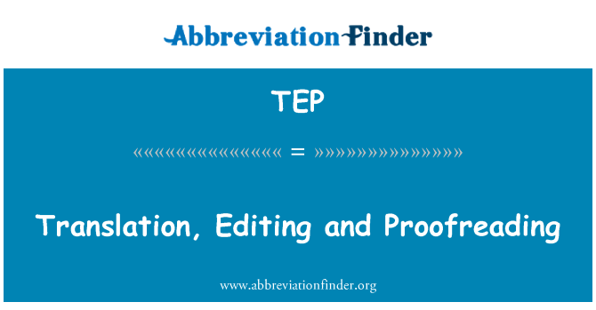

其实我还是挺讨厌缩略语的，尤其是接触到了自己不熟悉的领域内容。刚开始研究本地化这方面的经验知识的时候，看到TEP还是蛮迷惑的。

## 什么是TEP？

本地化的工作中，翻译不是一步到位的，TEP是指翻译（Translation）、编辑（Editing）和校对（Proofreading），这三个步骤是整个翻译过程中最重要的部分。

## 为什么要TEP？

主要目的是为了保障翻译的准确性，减少翻译的错误。

## 编辑和校对的区别是啥？

其实光从中文文字理解，其实不太能直观地了解这两个环节之间的区别：

**Editing**更倾向于校对：检查错字、标点和语法，对原文的修改幅度最小。**Proofreading**可以理解为润色：阅读译文，加以修饰，让翻译的文本在母语者看来更加流畅自然，重点关注术语、文档结构等。
